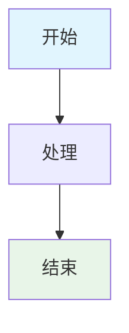

# Traefik 流程图说明

本目录包含了 Traefik 与 Docker Compose 关联关系的各种流程图，使用 Mermaid 语法编写。

## 📊 流程图列表

### 1. 启动流程 (startup-flow.mermaid)
**文件**: `startup-flow.mermaid`
**说明**: 展示从 Docker Compose 启动到服务可访问的完整流程
**内容**:
- Docker Compose 启动过程
- Traefik 容器初始化
- 服务发现机制
- 路由规则创建

### 2. 配置关联关系 (configuration-relationship.mermaid)
**文件**: `configuration-relationship.mermaid`
**说明**: 展示 docker-compose.yml 和 traefik.yml 之间的关联关系
**内容**:
- 配置文件挂载关联
- Docker Socket 挂载关联
- 网络连接关联
- 标签解析机制

### 3. 服务发现机制 (service-discovery.mermaid)
**文件**: `service-discovery.mermaid`
**说明**: 详细展示 Traefik 如何通过标签自动发现和配置服务
**内容**:
- 容器检测流程
- 标签解析过程
- 路由规则创建
- 配置应用机制

### 4. 请求流程 (request-flow.mermaid)
**文件**: `request-flow.mermaid`
**说明**: 展示用户请求从浏览器到后端服务的完整流程
**内容**:
- 请求入口
- 路由匹配
- 中间件处理
- 后端服务转发

### 5. 故障排除流程 (troubleshooting.mermaid)
**文件**: `troubleshooting.mermaid`
**说明**: 提供系统性的故障排除步骤
**内容**:
- 问题诊断流程
- 常见问题检查点
- 解决方案选择
- 验证步骤

## 🛠️ 如何使用这些流程图

### 在线查看
1. 访问 [Mermaid Live Editor](https://mermaid.live/)
2. 复制对应的 .mermaid 文件内容
3. 粘贴到编辑器中查看

### 本地查看
如果您使用支持 Mermaid 的工具：
- **VS Code**: 安装 Mermaid 插件
- **Typora**: 原生支持 Mermaid
- **GitHub**: 原生支持 Mermaid
- **GitLab**: 原生支持 Mermaid

### 导出图片
1. 在 Mermaid Live Editor 中打开流程图
2. 点击 "Download PNG" 或 "Download SVG"
3. 保存到本地使用

## 🎯 流程图使用场景

### 学习阶段
- 理解 Traefik 工作原理
- 掌握配置关联关系
- 学习服务发现机制

### 开发阶段
- 设计新的服务架构
- 规划配置修改
- 理解请求流程

### 运维阶段
- 故障排除指导
- 系统监控理解
- 性能优化参考

## 📝 流程图更新

如果您需要修改或添加新的流程图：

1. **创建新的 .mermaid 文件**
2. **使用标准的 Mermaid 语法**
3. **添加适当的颜色样式**
4. **更新本 README 文件**

### Mermaid 语法示例

## 🔗 相关文档

- [主文档](../traefik-docker-compose-relationship.md)
- [Mermaid 官方文档](https://mermaid.js.org/)
- [Mermaid 语法指南](https://mermaid.js.org/syntax/flowchart.html) 